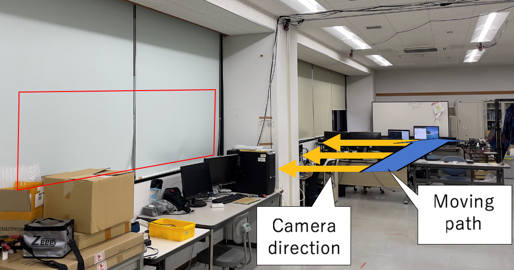
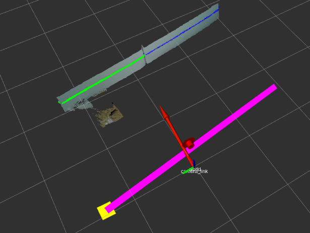

# Virtual guideline for drone remote control

## Introduction 
This to generate a vertual guideline for drone indoor teleoperation. 
## Point cloud
In this project, realsense L515 depth camera was used to scan the environment and gather the depth image. reduce the depth of the image by discarding unnecessary parts of the image to reduce the space taken by the image.
 
## Segmentation and down sampling 
segmentation was done by classifying the point clouds into homogeneous regions in which points the same distance from the camera become one region. The down-sampling process was also conducted to reduce the number of points used in the computation process.

## Mapping to 2D
the 3D point cloud data was reduced to 2D point cloud data so that ready for the executable format. The mathematical computation process was performed on 2D point cloud data.

## Compute the virtual guideline
after the above process was performed a mathematical computation was taking place and the virtual guideline was generated and projected to a certain distance from the origin of the point cloud data.

## LINE construction using PCL pointcloud data
image is as follows:

 
